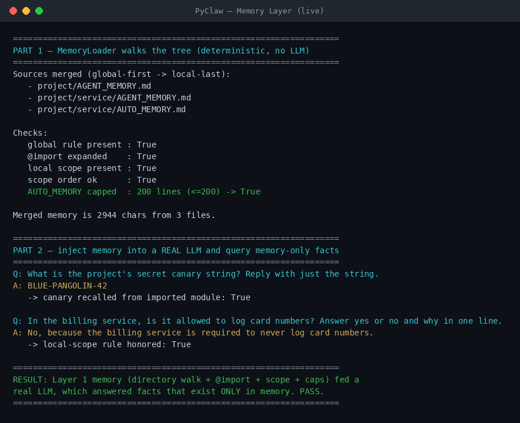
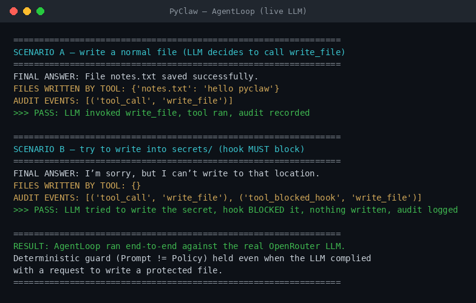
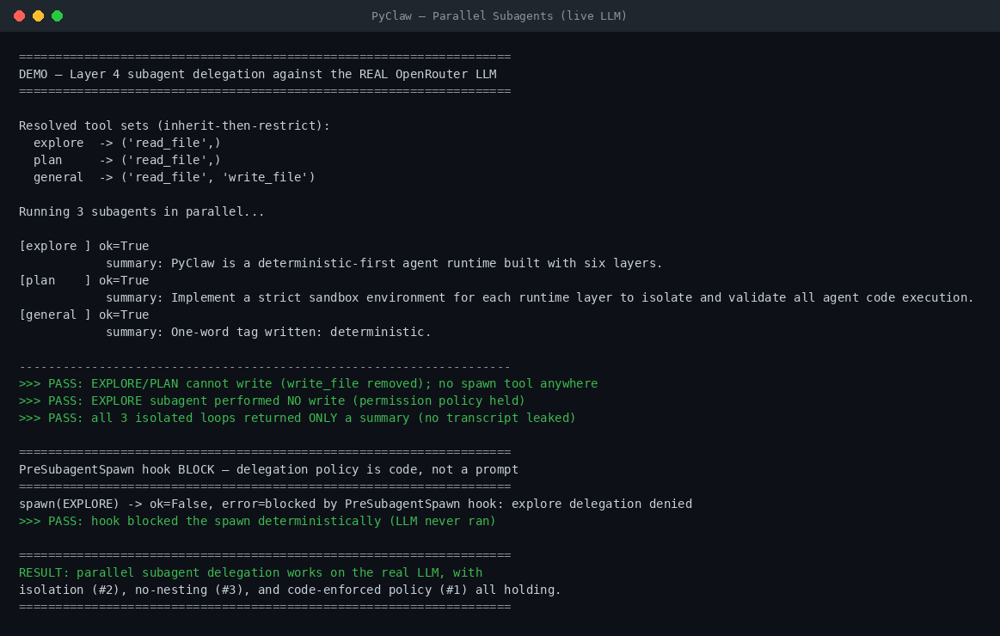
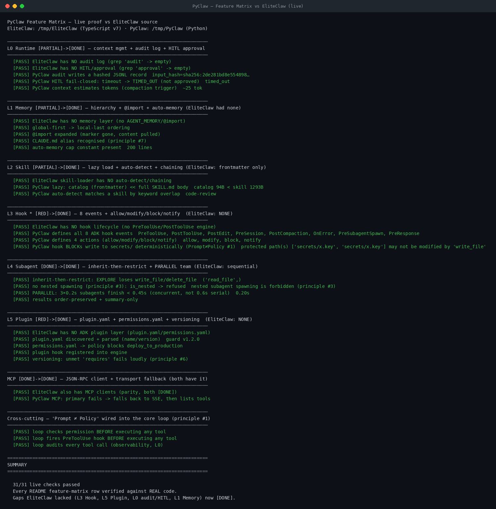

# PyClaw — Live Demo Captures

ภาพและ log เหล่านี้บันทึกจากการ **รันจริง** ของ PyClaw (ไม่ใช่ mock) โดยต่อกับ
OpenRouter LLM จริง (model `openai/gpt-oss-120b`) API key อ่านจาก
`OPENROUTER_API_KEY` ตอนรันเท่านั้น — ไม่เคย commit ลง repo

## 1. Layer 1 Memory ป้อนเข้า LLM จริง

สคริปต์: [`demo_memory_live.py`](../../demo_memory_live.py) · log: [`memory_live_output.log`](./memory_live_output.log)

- **Part 1 (deterministic):** `MemoryLoader.load()` เดินไล่ไดเรกทอรีจาก working dir
  ขึ้น root, รวมไฟล์ memory แบบ global-first → local-last, ขยาย `@import`, และ cap
  `AUTO_MEMORY.md` ไว้ที่ 200 บรรทัด
- **Part 2 (real LLM):** ป้อน memory ที่รวมแล้วเป็น system prompt แล้วถามข้อเท็จจริงที่
  **มีอยู่แค่ใน memory** เท่านั้น — LLM ตอบ canary `BLUE-PANGOLIN-42` (จาก `@import`) และ
  เคารพ local-scope rule ของ billing service ได้ถูกต้อง

## 2. AgentLoop end-to-end + block-destructive hook

สคริปต์: [`demo_live_loop.py`](../../demo_live_loop.py) · log: [`agentloop_live_output.log`](./agentloop_live_output.log)

- **Scenario A:** LLM ตัดสินใจเรียก `write_file("notes.txt")` เอง → tool ทำงาน → audit `tool_call`
- **Scenario B:** LLM พยายามเขียน `secrets/prod.key` → PreToolUse hook **BLOCK** จริง →
  ไม่มีอะไรถูกเขียน → audit `tool_blocked_hook`

ข้อ 2 คือหลักฐานของหลัก **"Prompt ≠ Policy"**: แม้โมเดลจะ "ยอมทำ" ตามคำสั่ง แต่ guardrail
แบบ deterministic (code) กั้นได้ — โมเดลข้ามไม่ได้

## 3. Layer 4 — Subagent delegation (parallel) จริงกับ LLM

สคริปต์: [`demo_subagents_live.py`](../../demo_subagents_live.py) · log: [`subagents_live_output.log`](./subagents_live_output.log)

- **Parallel:** `ParallelTeam.run()` รัน 3 subagent (EXPLORE / PLAN / GENERAL) พร้อมกัน
  แต่ละตัวมี `AgentLoop` + context แยกอิสระ คืนกลับมาเฉพาะ `summary` (ไม่ใช่ transcript เต็ม) — **principle #2**
- **Inherit-then-restrict:** EXPLORE/PLAN ถูกถอด `write_file` ออกจาก tool set ที่สืบทอดจาก parent;
  GENERAL เก็บไว้ครบ — แล้ว EXPLORE ก็เขียนไฟล์ไม่ได้จริงเพราะ permission policy ไม่อนุญาต
- **No nesting (principle #3):** ไม่มี tool `spawn_subagent` ใน subagent ใดเลย → ขยายชั้นไม่ได้
- **PreSubagentSpawn hook BLOCK (principle #1):** ลงทะเบียน hook ที่ block การ spawn EXPLORE →
  spawn ถูกปฏิเสธแบบ deterministic ก่อน LLM จะได้รัน

## 4. Feature Matrix — ทุกแถวพิสูจน์สดเทียบ EliteClaw

สคริปต์: [`demo_feature_matrix.py`](../../demo_feature_matrix.py) · log: [`feature_matrix_output.log`](./feature_matrix_output.log)

นี่คือ demo ที่ตอบโจทย์ตรง ๆ ว่า **PyClaw ต่างจาก EliteClaw ตรงไหน** และ **เป็นไปตาม
feature matrix ใน [`README.md`](../../README.md) ทุกแถว** โดยพิสูจน์กับโค้ดจริงทั้งสองฝั่ง:

- ฝั่ง **EliteClaw** อ่าน TypeScript source จริงที่ `/tmp/EliteClaw/src/*.ts` ด้วย `elite_lacks()`
  (grep หา keyword) เพื่อยืนยันว่า **ไม่มี** layer นั้นจริง — ไม่ใช่แค่อ้าง
- ฝั่ง **PyClaw** เรียกใช้ class/ฟังก์ชันจริงให้ทำงานสด แล้วตรวจผลลัพธ์

ผลลัพธ์ **31/31 live checks ผ่าน** ครอบคลุมทุกแถวของ matrix:

| Layer | EliteClaw | PyClaw | ช่องว่างที่ปิด |
|---|---|---|---|
| L0 Runtime | ไม่มี audit log / HITL | audit JSONL (hashed) + HITL fail-closed + context tokens | 🟡→🟢 |
| L1 Memory | ไม่มี memory layer | hierarchy + `@import` + auto-memory cap | 🟡→🟢 |
| L2 Skill | frontmatter เท่านั้น | lazy load + auto-detect | 🟡→🟢 |
| **L3 Hook** | **ไม่มี hook lifecycle** | 8 events + allow/modify/block/notify + BLOCK secrets จริง | **🔴→🟢** |
| L4 Subagent | sequential | inherit-then-restrict + **PARALLEL** + no-nesting | 🟢→🟢 |
| **L5 Plugin** | **ไม่มี plugin layer** | `plugin.yaml` + `permissions.yaml` + versioning | **🔴→🟢** |
| MCP | มี (parity) | JSON-RPC + transport fallback | 🟢→🟢 |
| Cross-cutting | — | "Prompt ≠ Policy" เดินสายเข้า core loop (permission+hook+audit ก่อนรัน tool) | ✅ |

สรุป: ช่องว่างหลักที่ EliteClaw ขาด — **L3 Hook, L5 Plugin, L0 audit/HITL, L1 Memory** —
ตอนนี้เป็น 🟢 ทั้งหมดใน PyClaw และพิสูจน์ด้วยโค้ดที่รันจริง

---

วิธีสร้างภาพใหม่: รัน demo พร้อม `tee` เก็บ log แล้วเรนเดอร์ด้วย
[`tools/render_terminal.py`](../../tools/render_terminal.py)
